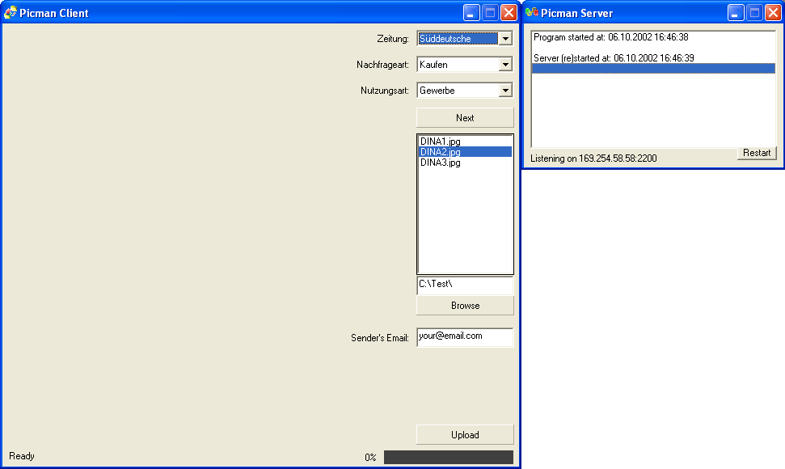



## File transfer using Winsock API \(Client \+ Server\)

### Description

This is a small example of how to make a listening server and a client that sends a file to it using Winsock API. How it works?: You need to open the server, then the client, select a folder containing images (BMP, GIF or JPG), for each image, you will need to select a value from the 3 combo boxes (these properties describe each image in some way), then you just enter the server's IP address and click on Send. The server accepts only one connection at a time (it stops listening until the transfer is complete), however, it can be modified to accet multiple connections. It uses a protocol similar to SMTP to get the image and its properties. It then saves the image and stores its info in a DB. Please vote if you like it. Thanks.
 
### More Info
 

             |
---                |---
**Submitted On**   |2002-04-16 22:05:48
**By**             |[Luis Cantero](https://github.com/Planet-Source-Code/PSCIndex/blob/master/ByAuthor/luis-cantero.md)
**Level**          |Intermediate
**User Rating**    |5.0 (10 globes from 2 users)
**Compatibility**  |VB 6\.0
**Category**       |[Internet/ HTML](https://github.com/Planet-Source-Code/PSCIndex/blob/master/ByCategory/internet-html__1-34.md)
**World**          |[Visual Basic](https://github.com/Planet-Source-Code/PSCIndex/blob/master/ByWorld/visual-basic.md)
**Archive File**   |[File\_trans1414251062002\.zip](https://github.com/Planet-Source-Code/luis-cantero-file-transfer-using-winsock-api-client-server__1-39590/archive/master.zip)

